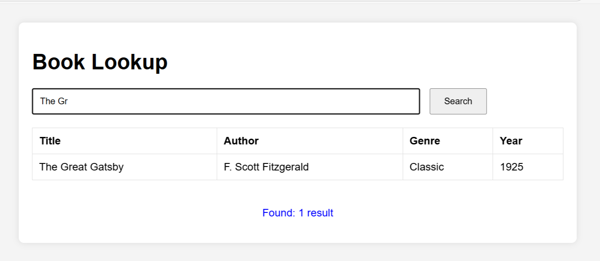
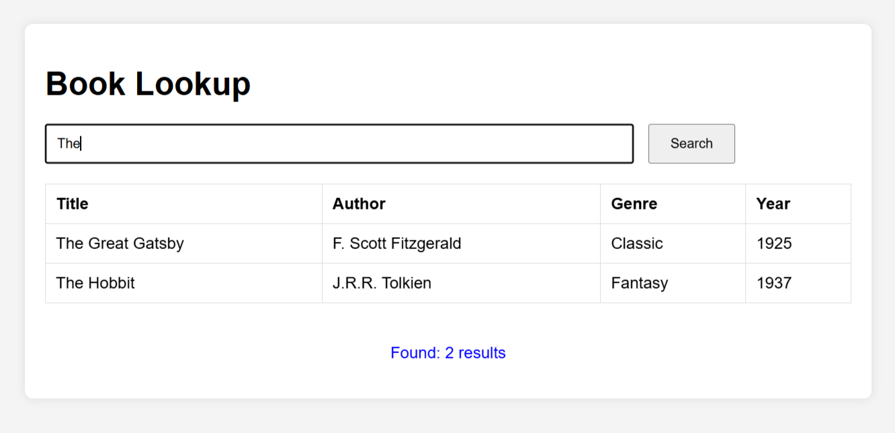
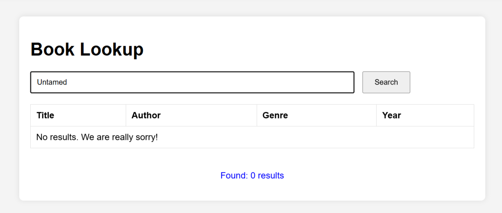
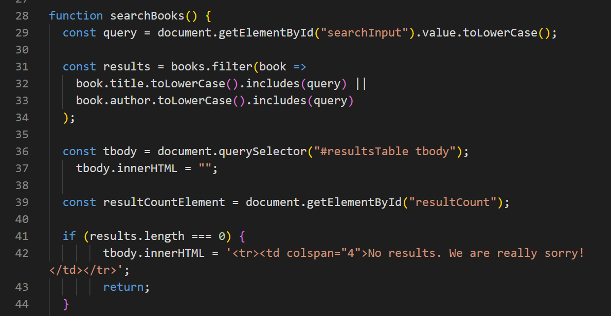

# book-lookup-js-sql

Front-end book lookup tool with HTML/CSS/JavaScript and a SQL data model. Shows search/filter functionality and SQL integration.

-------

# Book Lookup App 📚

## 📚 Overview
A simple front-end search app that filters book data using JavaScript and displays results in a clean HTML table.

-------

## 🔍 Features
- Search by book title or author
- Instant filtering from in-memory data
- Clean layout and responsive table

## 💻 Technologies
- HTML
- CSS
- JavaScript

## 🗂️ Files
- `index.html` – main UI
- `script.js` – core search logic
- `styles.css` – minimal styling
- `library_schema.sql` – database structure (future integration)

## 🚀 Demo
Simply open `index.html` in your browser and start searching!

--------

## 📸 Demo Screenshots

### 🔍 Start Page

### ✅ Search Result – 1 match

### ✅ Search Result – 2 matches

### ❌ No Results

### 🧠 JavaScript Logic (searchBooks function)

--------

*📄 Download my CV** → [Desislava_Georgieva_CV.pdf](./Desislava_Georgieva_CV.pdf)
